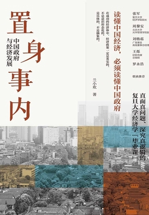
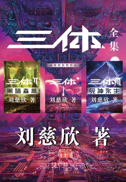
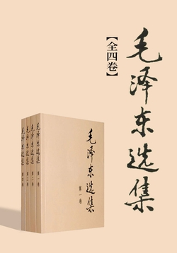
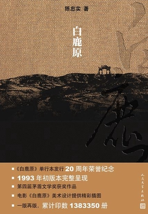
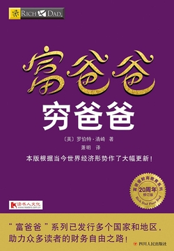

---
hide:
  - toc
---

# 读书

:material-book-open-outline: 读过 **2** 本 &emsp; :material-timer-outline: 阅读 **57** 分钟 &emsp; :material-calendar-check-outline: 阅读 **2** 天 &emsp; :material-pencil-outline: 笔记 **0** 条

  在读
  
  

    <h3>置身事内：中国政府与经济发展</h3>
    
兰小欢

    
★★★★★ 9.4

    
本书以地方政府投融资为主线，深入浅出地论述了中国经济的发展，广泛采纳各领域学者全新研究成果。

    
经济理财 · 上海人民出版社 · 2021

  

  待读
  
  

    <h3>三体全集（全三册）</h3>
    
刘慈欣

    
★★★★★ 9.3

    
荣获雨果奖。关于宇宙最狂野的想象！征服世界的中国科幻神作！

    
科幻小说 · 重庆出版社 · 2022

  

  待读
  
  

    <h3>毛泽东选集（全四卷）</h3>
    
毛泽东

    
★★★★★ 9.4

    
包括了毛泽东同志在中国革命各个时期中的重要著作，按历史时期和著作年月次序编辑。

    
政治军事 · 人民出版社 · 1991

  

  待读
  
  

    <h3>明朝那些事儿（全集）</h3>
    
当年明月

    
★★★★★ 9.2

    
以史料为基础，以年代和具体人物为主线，加入小说的笔法，幽默风趣地讲述明朝三百年历史。

    
历史 · 浙江人民出版社 · 2011

  

  待读
  
  

    <h3>白鹿原</h3>
    
陈忠实

    
★★★★★ 9.1

    
茅盾文学奖获奖作品。一部渭河平原50年变迁的雄奇史诗，一轴中国农村斑斓多彩的长幅画卷。

    
年代小说 · 人民文学出版社 · 1993

  

  待读
  
  

    <h3>盗墓笔记</h3>
    
南派三叔

    
★★★★★ 8.9

    
50年前出土的战国帛书记载了一个奇特古墓的位置，50年后一场惊心动魄的盗墓之旅展开。

    
悬疑灵异 · 男生小说

  

  待读
  
  

    <h3>富爸爸穷爸爸</h3>
    
罗伯特·清崎

    
★★★★☆ 8.3

    
清崎有两个爸爸："穷爸爸"是高学历的教育官员，"富爸爸"是善于投资理财的企业家。

    
理财 · 四川人民出版社 · 2017

  

---

数据来源：微信读书 · 更新于 2026-05-18
